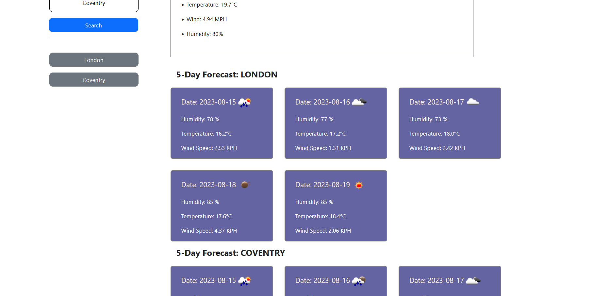

# Weather Dashboard App

The Weather Dashboard App is a web-based application that allows users to search for weather information for different cities. Users can input a city name, and the app will display the current weather conditions along with a 5-day forecast. Additionally, the app provides a search history feature that allows users to quickly access weather information for previously searched cities.

## Features

- **Search Form**: The app features a search form where users can input a city name and submit a search to retrieve weather data.

- **Current Weather**: Upon searching for a city, the app displays the current weather conditions, including temperature, wind speed, humidity, and a weather icon.

- **5-Day Forecast**: The app provides a 5-day weather forecast for the searched city. Each day's forecast includes temperature, humidity, wind speed, and a weather icon.

- **Search History**: The app keeps track of previously searched cities and displays them as buttons for easy access. Users can click on these buttons to quickly retrieve weather information for a specific city.

## Usage

1.  Open the Weather Dashboard App in a web browser
    [app deployed link](https://heisen101.github.io/Weather-Dashboard/)
2.  In the search input field, enter the name of the city for which you want to retrieve weather information.

    

3.  Click the "Search" button to initiate the search.

4.  The app will display the current weather conditions for the searched city, including temperature, wind speed, humidity, and a weather icon.

    

5.  Scroll down to view the 5-day weather forecast, with each day's forecast including temperature, humidity, wind speed, and a weather icon.

    

6.  To view weather information for a previously searched city, click on the corresponding city button in the search history section.

## Technologies Used

- HTML: Used for structuring the web page and creating user interface elements.

- CSS (Bootstrap): Provided styling and layout for the app.

- JavaScript (jQuery): Implemented the dynamic behavior of the app, including fetching weather data from the OpenWeatherMap API and updating the user interface.

- OpenWeatherMap API: Used to retrieve weather data for cities based on user input.

- Day.js: Used for date formatting and manipulation.

## Installation

1. Clone this repository to your local machine:
   [repository link](https://github.com/Heisen101/Weather-Dashboard)

2. Open the `index.html` file in a web browser to launch the Weather Dashboard App.

## Credits

This Weather Dashboard App was developed by Vasile Orbu. It utilizes the Bootstrap framework for styling and layout, jQuery for dynamic behavior, and the OpenWeatherMap API for weather data.

## License

This project is licensed under the [MIT License](LICENSE)
